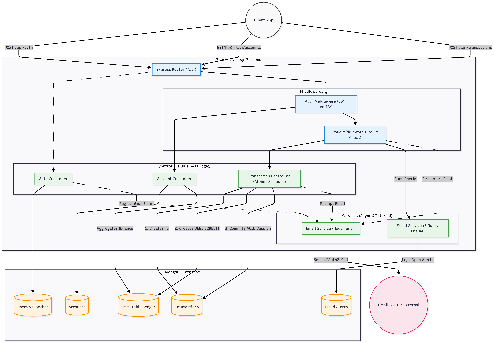
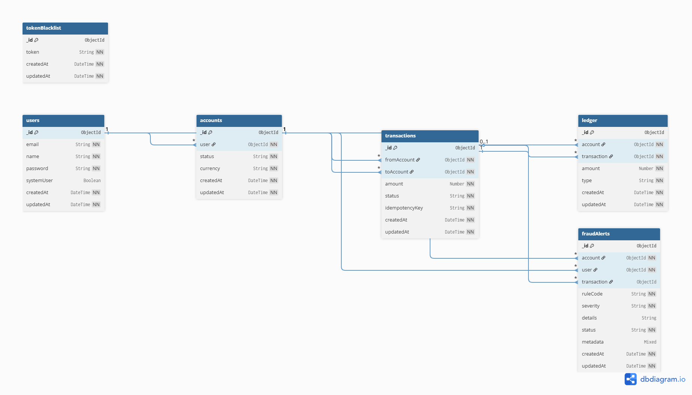

# 📒 Backend Ledger

<div align="center">

[](https://nodejs.org/)
[](https://expressjs.com/)
[](https://www.mongodb.com/)
[](https://jwt.io/)
[](https://backend-ledger-tbxj.onrender.com/api/docs/)
[](LICENSE)

A robust Node.js/Express ledger service featuring **immutable transaction logs**, **idempotent financial transfers**, and **reliable account management** powered by MongoDB with secure JWT authentication.

</div>

---

## 📑 Table of Contents

- [Overview](#-overview)
- [Architecture](#-architecture)
- [Entity Relationship Diagram](#-entity-relationship-diagram)
- [API Reference](#-api-reference)
- [Installation](#-installation)
- [Environment Variables](#-environment-variables)
- [Running the App](#-running-the-app)

---

## 🔍 Overview

**Backend Ledger** is a production-grade financial ledger REST API built for reliability and correctness. It provides:

- 🔒 **Secure Authentication** — JWT-based auth for all protected routes
- 💳 **Account Management** — Create and manage user accounts with real-time balance tracking
- 💸 **Idempotent Transfers** — Safe, duplicate-proof financial transfers between accounts
- 📜 **Immutable Transaction Logs** — Every debit and credit is permanently recorded and auditable
- ⚡ **Transactional Safety** — Critical operations use MongoDB sessions to ensure data consistency
- 📄 **OpenAPI Docs** — Interactive Swagger UI for exploring and testing all endpoints

---

## 🏗 Architecture



> 📐 For a detailed in-depth explanation of the system design, module responsibilities, and data flow, refer to the [`docs/ARCHITECTURE.md`](./docs/ARCHITECTURE.md) file.

---

## 🗃 Entity Relationship Diagram



> 📊 For the full interactive ERD with detailed column types, constraints, and relationships, visit **[dbdocs.io — Backend Ledger Project](https://dbdocs.io/omprakashsamal75/Backend-Ledger-Project)**.

---

## 📡 API Reference

The API is organized around the following core resource groups:

| Group | Base Path | Description |
|---|---|---|
| **Auth** | `/api/auth` | Register, login, and token management |
| **Accounts** | `/api/accounts` | Create and manage ledger accounts |
| **Transfers** | `/api/transfers` | Initiate idempotent fund transfers |
| **Ledger** | `/api/ledger` | View immutable transaction history |

All endpoints follow RESTful conventions and return JSON responses. Protected routes require a `Bearer` token in the `Authorization` header.

> 📖 For the complete interactive API documentation including request/response schemas, authentication flows, and a live try-it-out console, visit:
> **[https://backend-ledger-tbxj.onrender.com/api/docs/](https://backend-ledger-tbxj.onrender.com/api/docs/)**

---

## ⚙️ Installation

### Prerequisites

Make sure you have the following installed:

- [Node.js](https://nodejs.org/) v18 or higher
- [npm](https://www.npmjs.com/) v9 or higher
- [MongoDB](https://www.mongodb.com/) v6 or higher (local) or a [MongoDB Atlas](https://www.mongodb.com/atlas) cluster

### Steps

**1. Clone the repository**

```bash
git clone https://github.com/omprakash0224/Backend-Ledger.git
cd Backend-Ledger
```

**2. Install dependencies**

```bash
npm install
```

**3. Set up environment variables**

```bash
cp .env.example .env
```

Then edit `.env` with your configuration (see [Environment Variables](#-environment-variables) below).

**4. Configure your MongoDB connection**

Set your MongoDB connection string in `.env` (see [Environment Variables](#-environment-variables) below). You can use a local MongoDB instance or a free [MongoDB Atlas](https://www.mongodb.com/atlas) cluster — no manual schema setup is needed as Mongoose handles collection creation automatically.

---

## 🔐 Environment Variables

Create a `.env` file in the root directory with the following variables:

```env
MONGO_URI=your_mongodb_uri_here
JWT_SECRET=your_jwt_secret_here
CLIENT_ID=your_google_client_id_here
CLIENT_SECRET=your_google_client_secret_here
REFRESH_TOKEN=your_google_refresh_token_here
EMAIL_USER=your_email_user_here
```

---

## 🚀 Running the App

**Development mode** (with auto-reload):

```bash
npm run dev
```

**Production mode:**

```bash
npm start
```

The server will start at `http://localhost:3000` by default.

The interactive API docs will be available at `http://localhost:3000/api/docs/`.

---

<div align="center">

Made with ❤️ by [omprakash0224](https://github.com/omprakash0224)

</div>
